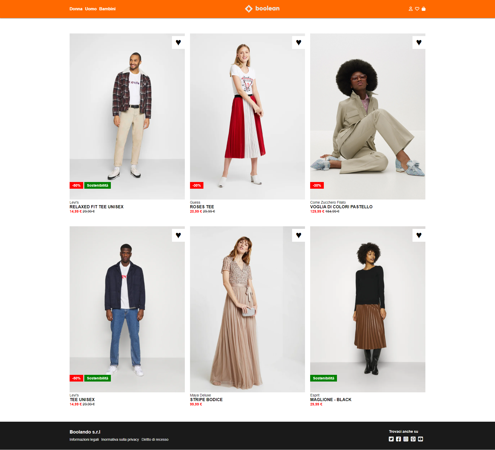

# Boolando

Questo progetto è un esercizio di sviluppo web che si ispira al famoso sito di e-commerce Zalando per replicare il suo layout in base a uno screenshot fornito. Il layout comprende una serie di prodotti visualizzati come card, ciascuna con un'immagine iniziale e un'immagine di hover. Inoltre, il progetto include un header con posizione fissa e un footer.

## Layout di riferimento


## Layout di riferimento (hover)



## Struttura

```bash
.
├── index.html
│
├── css/
│   ├── style.css
│
├── img/
│   ├── 1.webp
│   ├── 1b.webp
│   ├── 2.webp
│   ├── 2b.webp
│   ├── 3.webp
│   ├── 3b.webp
│   ├── 4.webp
│   ├── 4b.webp
│   ├── 5.webp
│   ├── 5b.webp
│   ├── 6.webp
│   ├── 6b.webp
│   ├── boolean-logo.png
│   ├── boolando.png
│   └── booland_hover.png
│
└── README.md
```
